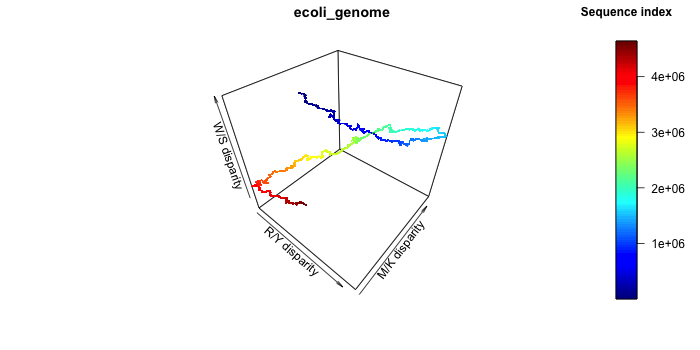

# Plotting a Z-curve

## Background


## Input files

### Required files

1. Input genome or gene files, in FASTA format - they can be in one-line or multi-line, as long as one file is given for each genome/gene, since the program will not distinguish them within the file. 

2. R script (included in this repo) - this gives the flexibility to have the scripts in another folder, but it is required to be added

## Installation

### Versions of languages and packages

In the table below you can find the versions used to build this script:

| Language/Module/Library | Version |
| :------------- |:-------------:| 
| Python|  3.8.10 |
| R | 4.1.1 |
| numpy | 1.20.3 |
| pandas | 1.3.3 |
| rpy2 | 3.1.0 | 
| plot3D | 1.4 | 

The versions of the python modules can be checks using check_versions.py. 

### Main scripts:

The repo can be cloned in a directory of choice as:

```shell
$ git clone https://github.com/aurazelco/BINP29_Zcurve.git
````

The scripts will then be available in the local directory, and can be run, as well as the sample_data folder to test the scripts on. 

### Before running:

The python script needs few modules to run properly; please install the following modules before proceeding:

The python script can be run in the command line as:
1. argparse
2. math
3. numpy
4. pandas
5. rpy2

If not present, the script will raise a ModuleNotFoundError, followed by the names of modules to be installed. Please do so before running again. 

The libraries for R are installed the first time the software is run, if not already present. 

## Usage (v1.0.0)

Below there is a description of the command, possible to be visualized in the command line with:

```shell
$ python plotZcurve.py -h

usage: plotZcurve.py [-h] -i INPUT_GENOME -Rfunc R_SCRIPT [-o OUTPUT_PLOT] [-f OUTPUT_FORMAT [OUTPUT_FORMAT ...]]

This script reads an input genome file in a FASTA format and returns the coordinates matrix to plot a Z-curve.

optional arguments:
  -h, --help            show this help message and exit
  -i INPUT_GENOME       input genome to calculate the Z-curve
  -Rfunc R_SCRIPT       R script containing the function to plot the Z-curve
  -o OUTPUT_PLOT        optional name for saving the plot, without file extension
  -f OUTPUT_FORMAT [OUTPUT_FORMAT ...]
                        optional list of formats (separated by space): example png pdf jpeg
```

There may be a FutureWarning appearing for a pandas function, depending on the operating system. At time of release, this does not constitute a problem. 

### Examples of usage

The sample data can be found in the corresponding folder in this repo. The genomes were retrieved  as RefSeq FASTA sequences from the NCBI database, and the links are found in the table below. 

| Species | Sample file name | Link |
| :---: |:---:| :---:|
| *E. coli* | ecoli_genome.fna | [https://www.ncbi.nlm.nih.gov/assembly/GCF_000005845.2] |
| Zika virus | zika_genome.fna | [https://www.ncbi.nlm.nih.gov/nuccore/NC_012532.1]|

The most basic command is:

```shell
python plotZcurve.py -i samples_data/ecoli_genome.fna -Rfunc Zcurve_func.R
````

This will output the plot with the default name and extension (output.png) in the working directory. 
If we want to specify an input file in another folder and save it with a specific name, we can run the following command:

```shell
python plotZcurve.py -i samples_data/ecoli_genome.fna -Rfunc Zcurve_func.R -o samples_output/ecoli
````

The script retrieves the input file in the subfolder, and saves the new plot in the samples_output subfolder as ecoli.png. 

Lastly, if we want to have multiple formats of the same graph, we can run:

```shell
python plotZcurve.py -i samples_data/zika_genome.fna -Rfunc Zcurve_func.R -o samples_output/zika_mult -f png pdf jpeg tiff  
```

This will create 3 versions of the same plot, in the different formats. 

Below, a representative output of the commands above, ecoli.png and zika_mult.tiff, which can also be found in the repo samples_output/folder.



The first image is the result of the second example command. 


This instead is the result of the last example command. 
The Z-curve is colored by where we are in the genome sequence (sequence index); therefore, we can follow the sequence from start to end, and if we are interested in a particular region, we know already circa in which position we should be looking into. 

The axes are the following:
- x: R/Y disparity
- y: M/K disparity
- z: W/S disparity

Depending on how the line fits in the tridimensional space, we can infer something on the genome plotted. 
For example, if we look at the *E. coli* Z-curve (top plot), we see that the genome overall forms an open circle in the 3D space, indicating that start and end of the genome are quite similar to each other, while the mid section (1.5e+6 - 3.5e+6 circa) is quite different, especially along the y and z axes. 

The Zika genome (bottom plot) instead seems to vary throughout the sequence especially in W/S disparity (z), while the other two parameters are rather constant, and in fact align quite well with the diagonal in the xy space. 

## Version log

Selected updates:

```
v1.0.0		First official release Zcurve - March 2022
```