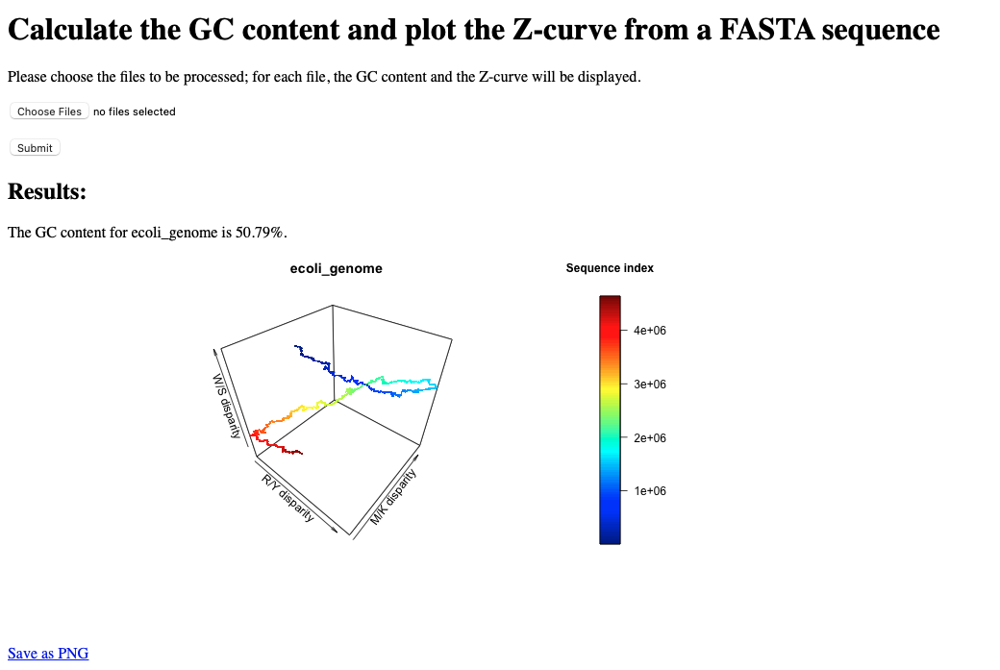
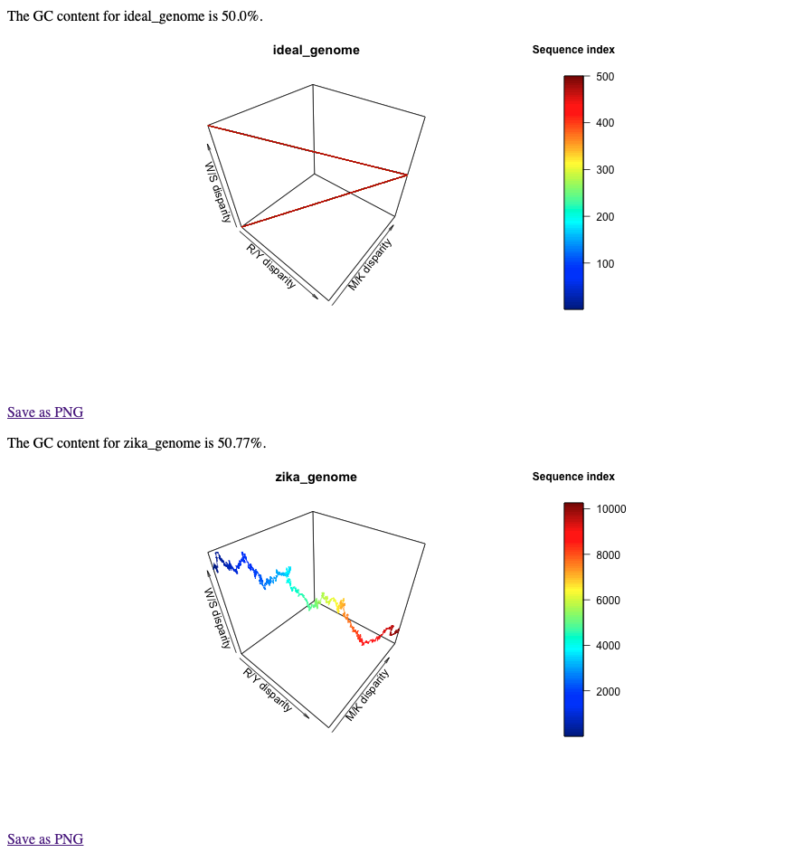

# Plotting a Z-curve

## Background

In this section, a summarized introduction of the Z-curve is given; more information about the Z-curve calculations and other info can be found [here](Zcurve_MS.pdf). 

The Z-curve is used in bioinformatics analysis to infer chemical properties of the genome (or gene) sequence in exam; since the curve tends to zig-zag, the 3D line is called Z-curve.

The Z-curve is as long as the target sequence, and each point on the Z-curve, *P* is defined by 3 axes (x,y,z). Thus, each *P* represents one position in the nucleotide sequence. 

As aforementioned, the coordinates for each *P* are calculated based on the chemical properties sequence (more details in [this paper](https://www.ncbi.nlm.nih.gov/pmc/articles/PMC4009844/)). 

More specifically, the nucleotides are divided in according to three properties:
1. aMino/Keto (M/K) bases
2. puRine/pYrimide (R/Y) bases
3. Weak/Strong H-bonds (W/S). 

Therefore, each nucleotide is classified as:

| Nucleotide | M/K | R/Y | W/S |
|:---:|:---:|:---:|:---:|
|Adenine (A) | M | R | W |
| Cytosine (C) | M | Y | S | 
| Guanine (G) | K | R | S |
| Thymine (T) | K | Y | W |

Therefore, the cumulative quantity of each nucleotide in a specific point of the sequence can indicate if there is a disparity or not in the composition of the sequence. One of the advantages of the Z-curve compared to other methods is that it is highly informative, unique to each genome and can reveal interesting sections of the genome, e.g. horizontal gene transfer, protein-coding genes, higher GC content, comparison of genomes, etc.

## Input files

### Required files

1. Input genome or gene files, in FASTA format - they can be in one-line or multi-line, as long as one file is given for each genome/gene, since the program will not distinguish them within the file. 

# Installation

## Versions of languages and packages

In the table below you can find the versions used to build this script and the web interface:

| Language/Module/Library | Version |
| :------------- |:-------------:| 
| Python|  3.8.10 |
| R | 4.1.1 |
| numpy | 1.22.3 |
| pandas | 1.4.1 |
| rpy2 | 3.1.0 | 
| plot3D | 1.4 | 
| Flask | 2.0.3 |
| Werkzeug | 2.0.3 |

The versions of the python modules can be checks using check_versions.py. While pandas and numpy older versions work too, it is necessary to install the rpy2 specific version, since updating it to later versions leads to an error in loading th R library. 

The requirements can be found in [environment.yml](environment.yml) for conda or [requirements.txt](requirements.txt) for python virtual environments, and it can be installed as:

```shell
conda env create -n your_name -f environment.yml # but requirements.txt can be used too
# or
pip install -r requirements.txt
```

Otherwise, the environments can be created from scratch following the usual commands and specifying the versions. Most often, pandas and numpy will be already included in the conda environment. For python virtual environments, they need to be installed. 

## Main scripts:

The repo can be cloned in a directory of choice as:

```shell
$ git clone https://github.com/aurazelco/BINP29_Zcurve.git
````

The scripts will then be available in the local directory, and can be run, as well as the sample_data folder to test the scripts on. 

## Before running:

As aforementioned, it is recommended to work in a conda or python virtual environment with the specific version of rpy2 installed. 

The python script needs few modules to run properly; please install the following modules before proceeding:

The python script can be run in the command line as:
1. argparse
2. math
3. numpy
4. pandas
5. rpy2

If not present, the script will raise a ModuleNotFoundError, followed by the names of modules to be installed. Please do so before running again. 
The libraries for R are installed the first time the software is run, if not already present. 


## Command line - Usage (v1.0.0)

Below there is a description of the command, possible to be visualized in the command line with:

```shell
$ usage: plotZcurve.py [-h] -i INPUT_GENOME [INPUT_GENOME ...] [-f OUTPUT_FORMAT [OUTPUT_FORMAT ...]] [-o OUTPUT_PATH] [-s SCRIPT_PATH] [-gc] [-out_gc OUTPUT_GC]

This script reads an input genome file in a FASTA format and returns the coordinates matrix to plot a Z-curve.

optional arguments:
  -h, --help            show this help message and exit
  -i INPUT_GENOME [INPUT_GENOME ...]
                        input genome(s) to calculate the Z-curve, can be more than one
  -f OUTPUT_FORMAT [OUTPUT_FORMAT ...]
                        optional: list of formats (separated by space): example png pdf jpeg
  -o OUTPUT_PATH        optional: path to output directory
  -s SCRIPT_PATH        path to Zcurve_func.R, needed if the R script is not in the current working directory
  -gc                   optional: in case -save_gc is used, the script will save the GC content calculations to a file instead of printing to the console
  -out_gc OUTPUT_GC     optional: output file where the GC content will be written in the -gc flag is used (default 'GC_content_output.txt' in the working directory)
```

There may be a FutureWarning appearing for a pandas function, depending on the operating system. At time of release and with the version specified, this does not constitute a problem. 

### Examples of usage

The sample data can be found in the corresponding folder in this repo. The genomes were retrieved  as RefSeq FASTA sequences from the NCBI database, and the links are found in the table below. 

| Species | Sample file name | Link |
| :---: |:---:| :---:|
| *E. coli* | ecoli_genome.fna | [https://www.ncbi.nlm.nih.gov/assembly/GCF_000005845.2] |
| Zika virus | zika_genome.fna | [https://www.ncbi.nlm.nih.gov/nuccore/NC_012532.1]|

The most basic command is:

```shell
python plotZcurve.py -i samples_data/ecoli_genome.fna -Rfunc Zcurve_func.R
````

This will output the plot with the default name and extension (output.png) in the working directory. 
If we want to specify an input file in another folder and save it with a specific name, we can run the following command:

```shell
python plotZcurve.py -i samples_data/ecoli_genome.fna -Rfunc Zcurve_func.R -o samples_output/ecoli
````

The script retrieves the input file in the subfolder, and saves the new plot in the samples_output subfolder as ecoli.png. 

Lastly, if we want to have multiple formats of the same graph, we can run:

```shell
python plotZcurve.py -i samples_data/zika_genome.fna -Rfunc Zcurve_func.R -o samples_output/zika_mult -f png pdf jpeg tiff  
```

This will create 3 versions of the same plot, in the different formats. 

Below, a representative output of the commands above, ecoli.png and zika_mult.png, which can also be found in the repo samples_output/folder.


The first image is the result of the second example command. 


This instead is the result of the last example command. 
The Z-curve is colored by where we are in the genome sequence (sequence index); therefore, we can follow the sequence from start to end, and if we are interested in a particular region, we know already circa in which position we should be looking into. 

The axes are the following:
- x: R/Y disparity
- y: M/K disparity
- z: W/S disparity

Depending on how the line fits in the tridimensional space, we can infer something on the genome plotted. 
For example, if we look at the *E. coli* Z-curve (top plot), we see that the genome overall forms an open circle in the 3D space, indicating that start and end of the genome are quite similar to each other, while the mid section (1.5e+6 - 3.5e+6 circa) is quite different, especially along the y and z axes. 

The Zika genome (bottom plot) instead seems to vary throughout the sequence especially in W/S disparity (z), while the other two parameters are rather constant, and in fact align quite well with the diagonal in the xy space. 


## Web interface - Usage (v1.0.0)

The web interface was built using flask, in a development environment; therefore, some features are not optmized. In this repo, the main directory tree structure is found in flask_interface. 

### Necessary files and tree structure

To run the flask interface, the necessary files are needed, starting from the parent directory flask_interface:
1. webZcurve.py
2. .flaskenv
3. app (directory): containing routes.py, __init__.py
4. app/templates(directory): containing main_input.html, print_results.html


It is recommended to use the same conda or python virtual environment created before, and just install flask as well (if not installed already). 

```shell
conda activate Zcurve
conda install flask==2.0.3
# or
source Zcurve/bin/activate
pip -m install flask==2.0.3
```

Then the user needs to access the file app/routes.py in a text editor, and add where the files are stored in app.config['UPLOAD_PATH'], and where the script with the R function is located in app.config['SCRIPT_PATH']. For security reasons, this has to be done manually by the user according to their own local directory structure. If this is not done before running the application, flask will raise an error and the server will abort. 

### Running the web interface

After the necessary installations and modifications aforementioned, the app is ready to run, if all modules are installed and the necessary files are present. 
```shell
flask run
```

In the webpage, the user can navigate to the folder where the genomes are stored. Multiple files can be selected, as long as they have a .fna extension. Once the files are chosen, the user can click on 'Submit' to start the calculations. If the genomes are quite large, it may take some time for the results to be displayed.





For each file submitted, the GC content will be reported as well as the corresponding Z-curve plot; the user has also the possibility to download the plot as PNG. 

### Limitations of web interface

Because this was created in the flask developer environment, there are some limitations of the app when compared to the command line version. In the web interface, the user can download the plots only as png, because they are first created as png, since multiple file extensions was not possible at the moment (but it is in the command line).

Also, the fact that this is in the developer environment leads to the fact that the paths have to hard-coded in the script, since it would be a possible security issue. 
Therefore, the web interface is limited in functionality compared to the command line version. 

## Version log

Selected updates:

```
v1.0.0		First official release Zcurve - 14th March 2022
```
