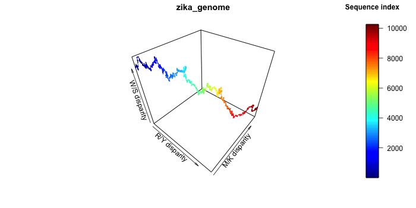
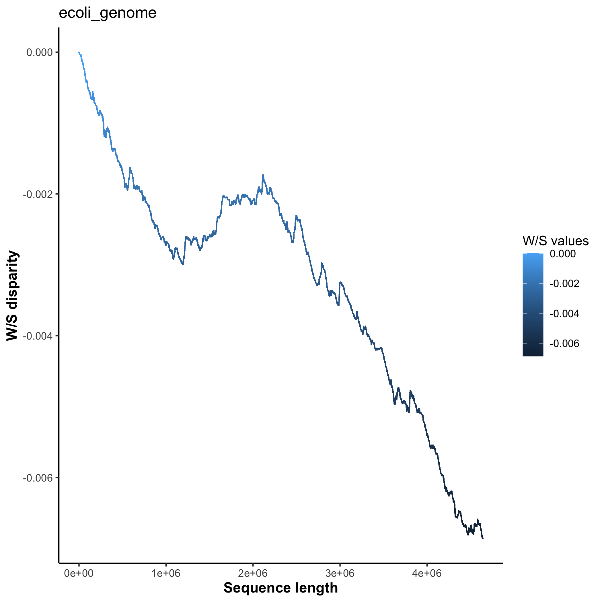
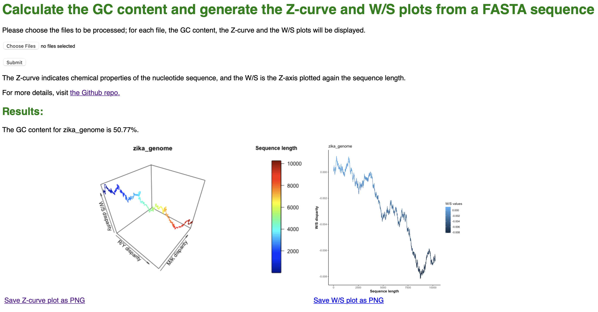

# Plotting a Z-curve

## Background

In this section, a summarized introduction of the Z-curve is given; more information about the Z-curve calculations and other details about the software can be found [here](Zcurve_MS.pdf). 

The Z-curve is used in bioinformatics analysis to infer chemical properties of the genome (or gene) sequence in exam; since the curve tends to zig-zag, the 3D line is called Z-curve.

The Z-curve is as long as the target sequence, and each point on the Z-curve, *P* is defined by 3 axes (x,y,z). Thus, each *P* represents one position in the nucleotide sequence. 

As aforementioned, the coordinates for each *P* are calculated based on the chemical properties sequence (more details in [this paper](https://www.ncbi.nlm.nih.gov/pmc/articles/PMC4009844/)). 

More specifically, the nucleotides are divided in according to three properties:
1. aMino/Keto (M/K) bases - will become the x-axis
2. puRine/pYrimide (R/Y) bases - will become the y-axis
3. Weak/Strong H-bonds (W/S) - will become the z-axis

Therefore, each nucleotide is classified as:

| Nucleotide | M/K | R/Y | W/S |
|:---:|:---:|:---:|:---:|
|Adenine (A) | M | R | W |
| Cytosine (C) | M | Y | S | 
| Guanine (G) | K | R | S |
| Thymine (T) | K | Y | W |

Therefore, the cumulative quantity of each nucleotide in a specific point of the sequence can indicate if there is a disparity or not in the composition of the sequence. One of the advantages of the Z-curve compared to other methods is that it is highly informative, unique to each genome and can reveal interesting sections of the genome, e.g. horizontal gene transfer, protein-coding genes, higher GC content, comparison of genomes, etc.


## Installation

### Main files:

The repo can be cloned in a directory of choice as:

```shell
$ git clone https://github.com/aurazelco/BINP29_Zcurve.git
````

The scripts will then be available in the local directory, as well as the environment files, the sample_data folder to test the scripts on and the flask_interface folder. 


### Versions of languages and packages

In the table below you can find the versions used to build this script and the web interface:

| Language/Module/Library | Version |
| :------------- |:-------------:| 
| Python|  3.8.10 |
| R | 4.1.1 |
| numpy | 1.22.3 |
| pandas | 1.4.1 |
| rpy2 | 3.1.0 | 
| plot3D | 1.4 | 
| ggplot2 | 3.3.5 |
| Flask | 2.0.3 |
| Werkzeug | 2.0.3 |

The versions of the python modules can be checks using [check_versions.py](scripts/check_versions.py). While pandas and numpy older versions work too, it is necessary to install the rpy2 specific version, since updating it to later versions leads to an error in loading th R library. 

The requirements can be found in [environment.yml](config_files/environment.yml) for conda or [requirements.txt](config_files/requirements.txt) for python virtual environments, and it can be installed as:

```shell
$ conda env create -n your_name -f environment.yml # but requirements.txt can be used too
# or
$ pip install -r requirements.txt
```

Otherwise, the environments can be created from scratch following the usual commands and specifying the versions. Most often, pandas and numpy will be already included in the conda environment. For python virtual environments, they need to be installed. 

**Important**: it is recommended to create either a conda or a python virtual environment, not both. Using both could cause conflicts which in turn will raise errors, and the software/flask app will not run.

### Before running:

As aforementioned, it is recommended to work in a conda or python virtual environment with the specific version of rpy2 installed. 

The python script needs few modules to run properly; please install the following modules before proceeding:

The python script can be run in the command line as:
1. argparse
2. math
3. numpy
4. pandas
5. rpy2

If not present, the script will raise a ModuleNotFoundError, followed by the names of modules to be installed. Please do so before running again. 
The libraries for R are installed the first time the software is run, if not already present. 

#### Additional steps for flask

If the user wants to run the flask app, the file [flask_interface/app/routes.py](flask_interface/app/routes.py) file has to be opened in a text editor, and the user has to add where the files are stored in app.config['UPLOAD_PATH'], and where the script with the R function is located in app.config['SCRIPT_PATH'], both as *absolute paths*. 

For security reasons, this has to be done manually by the user according to their own local directory structure. If this step is omitted, and the flask app is run, the app will raise an error and exit. 

```shell
# sets the upload path, so the files can be checked - please insert your own path
app.config['UPLOAD_PATH']= ''
# sets the path where the R script is - please insert your own path
app.config['SCRIPT_PATH'] = ''
```

## Required input files

Input genome or gene files, in FASTA format - they can be in one-line or multi-line, as long as one file is given for each genome/gene, since the program will not distinguish them within the file. 


## Command line - Usage (v1.0.0)

Below there is a description of the python software [plotZcurve.py](scripts/plotZcurve.py), possible to be visualized in the command line with:

```shell
$ python plotZcurve.py -h

usage: plotZcurve.py [-h] -i INPUT_GENOME [INPUT_GENOME ...] [-f OUTPUT_FORMAT [OUTPUT_FORMAT ...]] [-o OUTPUT_PATH] [-s SCRIPT_PATH] [-gc] [-out_gc OUTPUT_GC] [-ws]

This script reads an input genome file in a FASTA format and returns a Z-curve plot, the GC content in the sequence and optionally a W/S disparity plot.

optional arguments:
  -h, --help            show this help message and exit
  -i INPUT_GENOME [INPUT_GENOME ...]
                        input genome(s) to calculate the Z-curve, can be more than one - example: -i zika_genome.fna ecoli_genome.fna
  -f OUTPUT_FORMAT [OUTPUT_FORMAT ...]
                        optional: list of formats (separated by space) - example: -f png pdf jpeg
  -o OUTPUT_PATH        optional: path to output directory - example: -o results
  -s SCRIPT_PATH        path to R scripts, needed if the R scripts are not in the current working directory - example: -s scripts/
  -gc                   optional: in case -gc is used, the script will save the GC content calculations to a file instead of printing to the console
  -out_gc OUTPUT_GC     optional: output file where the GC content will be written in the -gc flag is used (default 'GC_content_output.txt' in the working directory) - example: -out_gc gc_results.txt
  -ws                   optional: in case -ws is used, the script will also generate a W/S plot only, corresponding to GC content; the plot(s) will be saved in the same format as the main Z-curve plot
```

There may be a FutureWarning appearing for a pandas function, depending on the operating system. At time of release and with the version specified, this does not constitute a problem. Also, in MacOS there seems to be an extra error with one of the R files for the library, but again this does not constitute a problem and the software runs smoothly. 

The R functions [Zcurve_func.R](scripts/Zcurve_func.R) and [WS_func.R](scripts/WS_func.R) are present in this repo and can be read for more documentation. Please **store the R scripts together in the same folder**, so that the -s flag can be valid for both. If not, the script will not find one of the two functions and will exit after raising an error. 

### Examples of usage

The sample data can be found in the corresponding folder in this repo. The genomes were retrieved  as RefSeq FASTA sequences from the NCBI database, and the links are found in the table below. 

| Species | Sample file name | Link |
| :---: |:---:| :---:|
| *E. coli* | ecoli_genome.fna | [https://www.ncbi.nlm.nih.gov/assembly/GCF_000005845.2] |
| Zika virus | zika_genome.fna | [https://www.ncbi.nlm.nih.gov/nuccore/NC_012532.1]|

The examples below respect the directory organization found in this repo, and they are run from the parent directory, where the README.md file is. Please modify the commands accordingly if the structure is changed. 

#### Example 1 - plot Z-curve

The most basic command is:

```shell
$ python scripts/plotZcurve.py -i examples/samples_data/ecoli_genome.fna -s scripts/
````

This will output the plot with the default name and extension (output.png) in the working directory. Below the generated graph is diplayed:


The Z-curve is colored by where we are in the genome sequence (sequence length); therefore, we can follow the sequence from start to end, and if we are interested in a particular region, we know already circa in which position we should be looking into. 

The axes are the following:
- x: R/Y disparity
- y: M/K disparity
- z: W/S disparity

Depending on how the line fits in the tridimensional space, we can infer something on the genome plotted. Most often, the users will be interested in the W/S disparity, representing AT vs GC content: if z is positive, we have more AT, and if negative, more GC. 

#### Example 2 - specify output directory

If we want to specify an input file in another folder, we can run the following command:

```shell
$ python scripts/plotZcurve.py -i examples/samples_data/ecoli_genome.fna -o examples/samples_output/ecoli -s scripts/
````
The script retrieves the input file in the subfolder, and saves the new plot in the samples_output subfolder as ecoli.png. 

#### Example 3 - saves GC content to output

If we want to save the gc content in a file, instead of having it printed to the screen, we can use the -gc flag. In the example below, the -out_gc flag is also present, so we can save the output where we want; if only -gc is used, the file will be saved in the working directory under 'GC_content_output.txt'. 

```shell
 python scripts/plotZcurve.py -i examples/samples_data/zika_genome.fna -gc -out_gc examples/samples_output/GC_cont_zika.txt -s scripts/
```

The [samples_output/GC_cont_zika.txt](examples/samples_output/GC_cont_zika.txt) file contains:
```shell
zika_genome: 50.77%
```

If multiple files are used as input, the output file will contain the GC content of each input in separate lines. 

#### Example 4 - generate Z-curve plot in multiple formats

If we want to have multiple formats of the same graph, we can run:

```shell
$ python scripts/plotZcurve.py -i examples/samples_data/zika_genome.fna -o examples/samples_output/zika_mult -f png pdf jpeg tiff  -s scripts/
```
This will create 3 versions of the same plot, in the different formats. Also it retrieves the R functions from another folder. 

Below, a representative output of the commands above, ecoli.png and zika_mult.png, which can also be found in the repo [samples_output/folder](samples_output/folder).


The first image is the result of the second example command, and as we can see it is the same as the one generated in the first example. 



This instead is the result of the last example command. 

For example, if we look at the *E. coli* Z-curve (top plot), we see that the genome overall forms an open circle in the 3D space, indicating that start and end of the genome are quite similar to each other, while the mid section (1.5e+6 - 3.5e+6 circa) is quite different, especially along the y and z axes. 

The Zika genome (bottom plot) instead seems to vary throughout the sequence especially in W/S disparity (z), while the other two parameters are rather constant, and in fact align quite well with the diagonal in the xy space. 

#### Example 5 - generate Z-curve and W/S plots

Lastly, the script can also provide W/S plots. The reason behind this additional feature is that GC content is ultimately the most widely used parameter of the three chemical properties displayed in the Z-curve plot; thus, the script gives the user the possibility to extract the coordinates for the Z-axis only. The user has to consider that W/S plot(s) generated are going to be in the same format as the one for the Z-curve; thefore if more formats are specified for the Z-curve, the same formats will be used to generate the W/S plots. 

For example:

```shell
$ python scripts/plotZcurve.py -i examples/samples_data/ecoli_genome.fna -o examples/samples_output -ws -s scripts/
```

In addition to the Z-curve plot, with the command above we also generated the following plot:



On the x-axis we have the sequence length, and on the y-axis the W/S disparity, corresponding to the z-axis in the Z-curve plots for *E. coli*. The legend indicates the values of the coordinates for the W/S disparity: if values equal or greater to 0, we have more AT than GC; below 0, we have more GC. Thus, in this plot, it seems that the Zika genome is progressively enriched in GC from start to end of the genome. 

## Web interface - Usage (v1.0.0)

The web interface was built using flask, in a development environment; therefore, some features are not optmized. In this repo, the main directory tree structure is found in [flask_interface](flask_interface). 

### Necessary files and tree structure

To run the flask interface, the necessary files are needed, starting from the parent directory flask_interface:
1. [webZcurve.py](flask_interface/webZcurve.py)
2. [.flaskenv](flask_interface/.flaskenv)
3. [flask_interface/app](flask_interface/app) (directory): containing subdirectories and the two main .py scripts
4. [flask_interface/app/templates](flask_interface/app/templates) (directory): containing main_input.html, print_results.html

It is recommended to use the same conda or python virtual environment created before, and just install flask (if not installed already). 

```shell
$ conda activate Zcurve
$ conda install flask==2.0.3
# or
$ source Zcurve/bin/activate
$ pip -m install flask==2.0.3
```

**Remember** to add the paths as indicated in the installation section, otherwise the flask app will not work. 

GitHub does not allow for empty directories to be pushed: therefore, in the flask_interface directory the static subfolder is missing. However, the flask app should create the static/images subfolders the first time is run; if not, then just create a directory called static in flask_env/app/, and then the app should run without problems. 


### Running the web interface

After the necessary installations and modifications aforementioned, the app is ready to run, if all modules are installed and the necessary files are present. After activating the conda or python virtual environment, use the following command when in the flask_interface directory: 

```shell
$ flask run
```

The flask app will print to the console a line similar to:

```shell
* Running on http:... (Press CTRL+C to quit) # ... will be an actual URL
```

To go to the webpage, open a web browser and copy-paste the URL, or right-click from the terminal (some operative systems allow that). 

In the webpage, the user can navigate to the folder where the genomes are stored. Multiple files can be selected, as long as they have a .fna extension. Once the files are chosen, the user can click on 'Submit' to start the calculations. If the genomes are quite large, it may take some time for the results to be displayed. An example of output is shown below. 



For each file submitted, the GC content will be reported as well as the corresponding Z-curve plot and W/S plot; the user has also the possibility to download the plots as PNG (while the flask app is still running). If multiple files are chosen, the results for each input file will appear one below the other. 

## Limitations of the software

1. The versions of the modules is extremely important, especially for rpy2 module to run. 
2. The software slows down when the genome files get bigger
3. Because the web interface was created in the flask developer environment, there are some limitations of the app when compared to the command line version. In the web interface, the user can download the plots only as png, because they are first created as png, since multiple file extensions was not possible at the moment (but it is in the command line). Also, since flask is in the developer environment, the paths have to hard-coded in the script to access the files, since it would be a possible security issue. Therefore, the web interface is limited in functionality compared to the command line version, and can be run only locally. 


## Version log

Selected updates:

```
v1.0.0		First official release Zcurve - th March 2022
```
